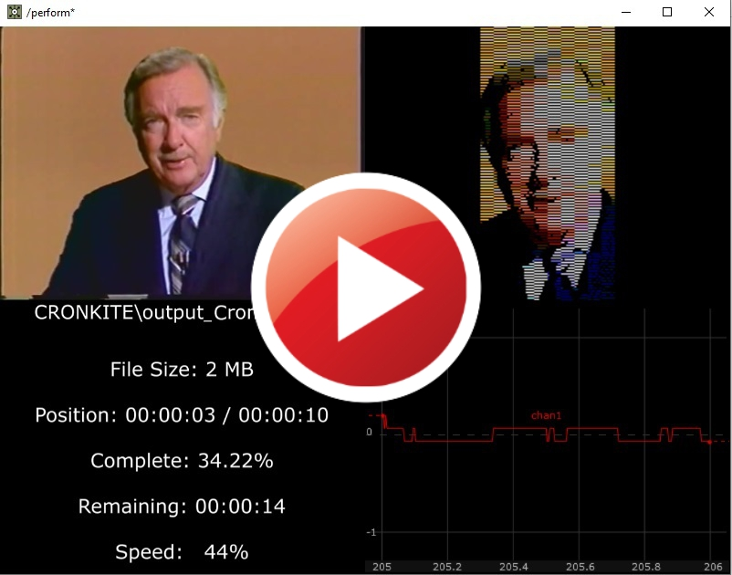
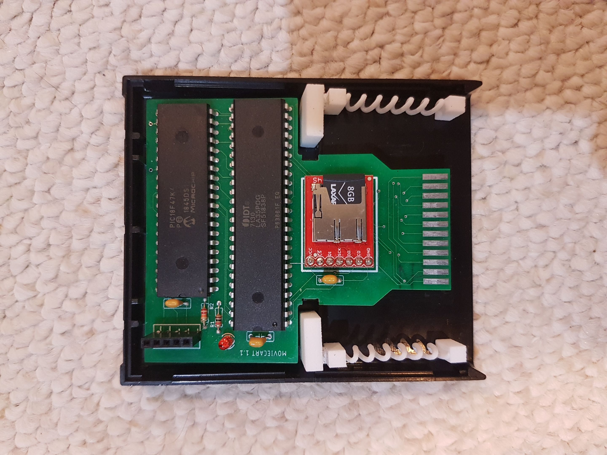
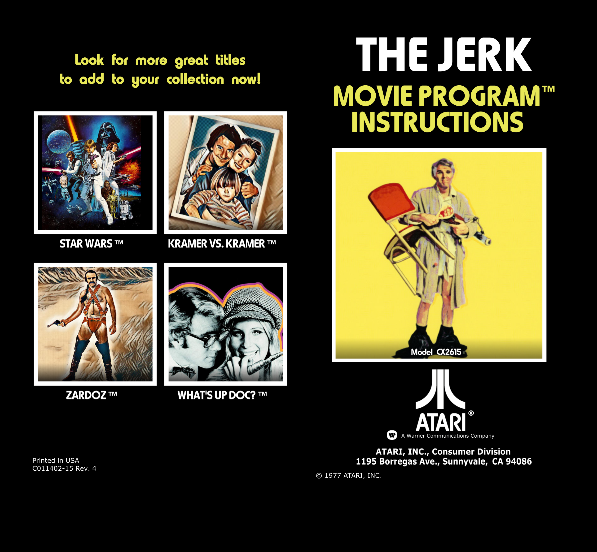

# moviecart
Software and Hardware to create full length color movie + audio cartridges for stock Atari 2600

September 11 1977

Introducing MovieCart.

This revolutionary new product will allow for the first time ever, anyone to experience the joy of the silver screen directly from the comfort of their own home, in stunning digital accuracy.
Boasting an impressive 80 x 192 resolution, 7 bit color and 4 bit monaural audio, begin building your full length feature film library today.*

Technical Specs:

   Two fields are alternated at 60 frames per second.
   Each field consists of a checkerboard pattern of 10 x 262 cells.
   Each cell contains one of 128 colours and is 8 pixels wide by 1 pixel deep.
   This produces an effective resolution of 80 x 262 @ 30 frames per second, with 10 colors per line.
   
   Sound is 4 bit mono produced at 15.720 KHz.

   Joystick controls brightness, volume, and shuttle position.
   Console switches control b/w, ten second rewind and full rewind.

   Each field requires 2.5K of data.
   Each second requires the equivalent of 75.5 Combat cartridges, or over half a million cartridges to produce a full length 2 hour movie.

Pre-Order Kits at:
https://www.tindie.com/products/lodefmode/moviecart-atari-2600/

Thanks,
lodef.mode@gmail.com

*Copyright Disclaimer under Section 107 of the copyright act 1976, allowance is made for fair use for purposes such as criticism, comment, news reporting, scholarship, and research. Fair use is a use permitted by copyright statute that might otherwise be infringing. Non-profit, educational or personal use tips the balance in favour of fair use."

